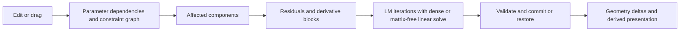

# ParaMagic solver architecture review — September 8, 2026

ParaMagic can remain a browser application and become substantially more scalable. Its update architecture, numerical backend, and several graph/execution paths impose avoidable costs. Subsequent mixed-geometry browser tests make coordinated edit propagation and incremental derived presentation the first implementation priority. A persistent Worker solver with constraint reduction, reusable sparse data, and a stronger numerical backend remains the next direction to evaluate. Moving the existing algorithm to WebAssembly alone would retain the surrounding update costs.

This initial review covers source inspection, numerical/graph benchmarks, and primary-source research. The subsequent supplied Ottoman drawing and rendered mixed-geometry tests materially changed the implementation priority: the update and derived-presentation architecture should be addressed first. See [mixed geometry findings](<C:/Apps/ParaMagic - Experiment/docs/SOLVER_MIXED_GEOMETRY_FINDINGS_2026-09-08.md>) for the browser evidence, stress failure, and revised recommendation. Neither audit implements a production performance upgrade. The user authorized considering WebAssembly despite the older plan's pure-JavaScript restriction.

Reviewed revision: `b5d9a6f81765e79d57a2d187e79b44faaa4c954e`. Application source was unchanged by this audit.

**How the current solver works**

The application selects Worker execution and block Jacobians by default in [main.js](<C:/Apps/ParaMagic - Experiment/src/main.js:1267>) and [SolverExecutionFacade.js](<C:/Apps/ParaMagic - Experiment/packages/paramagic-core/src/modules/solver/SolverExecutionFacade.js:652>). Direct library constructors retain synchronous/dense defaults. The short architecture overview in `docs/SOLVER.md` describes an older numerical pipeline; the source is more advanced.

1. `SolverModel.js` binds entities to scalar variables, resolves geometric features and Stack coordinate frames, and excludes fixed/drag-locked variables from the active state.
2. `ParameterRepository.js` maintains expression dependencies and dirty evaluation. Targets are sampled before numerical iterations instead of reevaluating expressions for every derivative.
3. `ConstraintGraph.js` connects constraints to their referenced variables. Controller seeds identify affected components and explicit Stack participation. A parameter can legitimately affect the whole drawing; disconnected-component optimization cannot solve this case by itself.
4. `ConstraintRegistry.js` evaluates residual equations and builds local derivative blocks. Common constraints have analytical derivatives; unsupported/branch-sensitive cases use local central differences. Global-coordinate constraints currently use numerical block derivatives.
5. `NumericSolverCore.js` uses Levenberg–Marquardt (LM): linearize the residuals, compute a damped step, accept it when error decreases, and repeat. Below 192 active variables in final mode, block mode still assembles dense normal equations and uses Gaussian elimination. The interactive threshold is 48 variables. Larger block-mode systems apply `J*v` and `J^T*v` without constructing a global dense matrix, and solve the damped normal system with preconditioned conjugate gradients (PCG).
6. `ComponentSolver.js` handles component transactions and temporary translation gauges. Existing explicit fixed/origin/drag relationships take precedence; gauge locks are released in `finally`. Drawing freedom must survive any replacement.
7. The Worker client coalesces queued drag requests and suppresses stale results. Drag numerical work has a 10 ms budget and 24 outer iterations. Final commits require convergence and can roll back. The canvas applies geometry deltas and refreshes dependent presentation systems.



**What the measurements show**

The audit harness imports the production component-scope solver. It constructs one connected, explicitly anchored chain, then measures either correction of disturbed horizontal/coincident geometry or the response to changing a shared length target from 10 to 12. It separately measures adding one coincidence bridge from a prebuilt chain to another horizontal line.

Times below are medians of three fresh-model samples on this machine: Intel Core Ultra 9 275HX, Windows x64, Node v22.20.0. The solve cases use current automatic block-mode selection, tolerance `1e-3`, a 500-outer-iteration cap, and a 15-second per-solve budget. All 42 measured solve samples converged, and a fresh residual evaluation verified the reported convergence threshold. Graph construction, controller continuation, Worker transport, rendering, history, and save/load are outside the numerical timers. The bridge column is graph maintenance only, without a numerical solve.

| Connected lines | Active variables | Correct disturbed chain | Shared length target change | Add one bridge: graph only |
|---:|---:|---:|---:|---:|
| 30 | 118 | 15.2 ms | 28.7 ms | 0.7 ms |
| 120 | 478 | 33.7 ms | 89.6 ms | 7.2 ms |
| 250 | 998 | 136.6 ms | 419.7 ms | 21.6 ms |
| 500 | 1,998 | 537.3 ms | 2,504.0 ms | 113.7 ms |
| 1,000 | 3,998 | 1,803.9 ms | 14,201.0 ms | 503.1 ms |

For the 1,000-line target change, linear algebra took 13,910 ms, about 98% of total solve time. There were 39 outer iterations; the last PCG solve reached its 1,000-iteration cap. That inner cap does not mean the outer solve failed: the resulting geometry passed the residual test. The current diagnostic records the last inner iteration count, not the sum across all outer iterations.

The existing matrix-free upgrade is valuable. At 120 lines, forcing the same analytical blocks through dense linear algebra took 970.6 ms for chain correction versus 33.7 ms automatically, and 2,139.7 ms for the shared target change versus 89.6 ms. This is a comparison of numerical backends, not a claim of browser speedup or identical geometry on underconstrained drawings.

Artifacts: [reproduction script](<C:/Apps/ParaMagic - Experiment/docs/benchmarks/2026-09-08-solver-audit/connected-scaling.mjs>) and [raw samples and environment](<C:/Apps/ParaMagic - Experiment/docs/benchmarks/2026-09-08-solver-audit/connected-scaling.json>). Reproduce from the repository root with:

```powershell
node docs/benchmarks/2026-09-08-solver-audit/connected-scaling.mjs
```

**The architectural limits, in priority order**

1. **Graph updates repeatedly traverse the same component.** In [ConstraintGraph.js](<C:/Apps/ParaMagic - Experiment/packages/paramagic-core/src/modules/solver/ConstraintGraph.js:311>), each visited variable scans the previous component's entire variable set. A large prior component therefore incurs quadratic scanning and can accumulate duplicate pending work. Repeated bridge insertions compound that cost. The measured 503 ms bridge update confirms this matters independently of the numerical solver. Replace this traversal with component expansion once per affected component and visited/enqueued tracking; batch structural changes before rebuilding affected partitions. Exact constraint-variable incidence can also improve the current conservative feature-level connectivity.

2. **Preconditioning misses coupling between entities.** [JacobianBlocks.js](<C:/Apps/ParaMagic - Experiment/packages/paramagic-core/src/modules/solver/JacobianBlocks.js:136>) groups variables by entity, with blocks of at most eight variables; larger entities fall back to singleton groups. This improves local coupling but does not capture long chains or tightly coupled clusters spanning many entities. [PCG](<C:/Apps/ParaMagic - Experiment/packages/paramagic-core/src/modules/solver/NumericSolverCore.js:185>) uses a fixed `1e-9` relative tolerance and up to 1,000 iterations. Each iteration is sparse, but the iteration count grows with the problem. Matrix-free storage does not imply linear total runtime.

3. **The problem is not sufficiently reduced before optimization.** Coincident endpoint coordinates and horizontal/vertical coordinate equalities remain separate variables and residual equations. Compile eligible exact affine relationships into shared coordinates/substitutions, then solve the remaining nonlinear system. Preserve original constraint IDs, enable/disable behavior, diagnostics, undo, and serialization. Only reduce rigid clusters whose internal degrees of freedom have actually been established. Long connected geometry cannot be split arbitrarily without preserving its coupling equations.

4. **Dense exceptions remain.** The half-chord arc projection in [NumericSolverCore.js](<C:/Apps/ParaMagic - Experiment/packages/paramagic-core/src/modules/solver/NumericSolverCore.js:862>) disables block/matrix-free solving for the whole affected solve. [StackPlacementSolver.js](<C:/Apps/ParaMagic - Experiment/packages/paramagic-core/src/modules/solver/StackPlacementSolver.js:155>) explicitly requests dense Jacobians for connected Stack placement systems. These paths need to participate in the sparse architecture. Their end-to-end impact was not benchmarked in this audit.

5. **Topology and numeric workspaces are rebuilt too often.** A block contract is reused within one solve, but rebuilt for the next. The matrix-free operator recreates block arrays, index maps and preconditioner storage every outer iteration. PCG initializes a new zero step and workspaces for each linear solve. Geometry already starts from its current values; what is missing is persistent compiled structure, reusable numerical storage, and carefully validated linear/predictor warm starts. Rejected LM steps also recompute derivatives even when the accepted state did not change.

6. **Worker authority is incomplete.** [SolverExecutionFacade.js](<C:/Apps/ParaMagic - Experiment/packages/paramagic-core/src/modules/solver/SolverExecutionFacade.js:306>) loads and solves the local model synchronously before resynchronizing the Worker. Constraint batches similarly call the local controller and send a complete snapshot. The ordinary `addConstraint` method solves locally; an authoritative alternative exists and is used by some callers. Thus having Worker mode enabled does not move every expensive action off the main thread. Batch creation is used by constraints and fillets in the actual application.

7. **Coalescing cannot interrupt a running committed operation.** `SolverWorker.js` invokes `runtime.handleRequest` synchronously; the client sends one request at a time. New queued requests cannot update cancellation state while that handler is busy. Drag numerical budgets help, but graph setup and other surrounding work are not comprehensively bounded by that budget. Final solves can monopolize the Worker. Dimension continuation can run multiple solves, and the retry in [SolverController.js](<C:/Apps/ParaMagic - Experiment/packages/paramagic-core/src/modules/solver/SolverController.js:2470>) allows 10,000 outer iterations. Use resumable work with explicit cancellation/transaction boundaries, adaptive continuation and progress reporting; retain strict final acceptance.

8. **Presentation still needs separate accounting.** [applySolverSnapshot](<C:/Apps/ParaMagic - Experiment/packages/paramagic-core/src/modules/infiniteCanvas.js:3253>) has an incremental path and passes changed IDs into derived systems. It also performs shared frame synchronization, and its full path refreshes broad presentation state. Controller emissions sometimes create full snapshots; Worker responses include full Stack state. These are source-confirmed work paths, not measured rendering bottlenecks. Trace them before choosing a different renderer.

Cross-Stack geometry also receives a tighter final tolerance (`1e-8` versus the ordinary `1e-3` default), and global-coordinate constraints currently lose analytical derivatives. This makes cross-Stack fixtures essential in the next benchmark corpus. Do not relax tolerances globally to make timing numbers look better; different residual families mix physical and normalized units and need explicit acceptance semantics.

**Browser-compatible alternatives**

| Option | Fit for ParaMagic | Decision |
|---|---|---|
| Upgrade the current JavaScript core | Preserves custom geometry, branch behavior and deployment; supports graph reduction, packed sparse storage and better algorithms | Useful immediate architectural work and comparison baseline |
| ParaMagic constraint compiler plus a WebAssembly numerical kernel | Keeps the app, file model and custom constraints; enables compiled Float64 sparse algebra | Preferred custom-engine direction to prototype |
| Siemens D-Cubed 2D DCM for WebAssembly | A purpose-built geometric constraint engine delivered for web applications | Strongest commercial candidate to evaluate alongside the custom direction |
| SolveSpace library port | Existing geometric solver with symbolic preprocessing and an exposed library interface | Secondary candidate; assess custom-constraint fit and available licensing terms |
| Remote solving service | Still an online app; can serve exceptional workloads | Optional later capability; network latency and service operation make it a poor default for dragging |

Siemens explicitly announced WebAssembly object releases of 2D DCM and PGM in version 79 on December 3, 2025. Its announcement also links a 60-day evaluation. This verifies browser availability, not superiority on ParaMagic drawings. No pricing, integration coverage, or ParaMagic performance was established here. [Siemens release announcement](https://blogs.sw.siemens.com/plm-components/d-cubed-2d-components-version-79-release/)

For a custom engine, prototype reusable sparse factorization and stronger cluster/incomplete-factorization preconditioning against the current PCG path. Include a QR or LSMR route for difficult conditioning and rank deficiency. The choice should depend on sparsity/fill, conditioning, memory and measured runtime, rather than active-variable count alone. Sparse direct solves can be particularly suitable for narrow chain/band structures, but arbitrary connected graphs can create substantial factorization fill.

Ceres is a candidate nonlinear optimization library to port and benchmark, not a drop-in CAD constraint replacement or a browser integration verified by this audit. Its documentation covers sparse/direct and iterative methods, inexact steps, and the conditioning tradeoffs of normal equations. Merely adopting its name or a Schur solver designed around a different problem structure would not establish better performance. [Ceres numerical methods](https://ceres-solver.readthedocs.io/latest/nnls_solving.html)

LSMR works through matrix-vector and transpose-vector operations and supports rectangular/rank-deficient least squares with useful numerical properties. It fits the existing operator boundary for an experiment, but still needs appropriate scaling/preconditioning and nonlinear acceptance. It is not guaranteed to reduce iterations on every sketch. ParaMagic's diagonal LM damping would need to be preserved through an augmented/scaled formulation. [Stanford LSMR](https://web.stanford.edu/group/SOL/software/lsmr/)

SolveSpace documents symbolic equations and forward substitution, demonstrating the geometric preprocessing direction. Its library page describes GPLv3 distribution and directs commercial licensing enquiries to the project; proprietary integration terms must be established before selecting it. [SolveSpace technology](https://solvespace.com/tech.pl), [library interface](https://solvespace.com/library.pl)

A WebAssembly kernel should keep compiled problem state and packed buffers resident inside the Worker, with bulk commands and deltas across boundaries. Avoid one JavaScript/WASM crossing per scalar residual. Start with a single-thread build; SIMD and a separate threaded build can follow measured need. Browser pthreads require SharedArrayBuffer and appropriate COOP/COEP hosting headers. Ordinary single-thread WebAssembly inside a Worker does not require pthreads. [Emscripten threads](https://emscripten.org/docs/porting/pthreads.html), [SIMD](https://emscripten.org/docs/porting/simd.html)

WebGPU is not the first numerical backend I would choose. Standard WGSL provides runtime `f32` and optional `f16`, without a standard native `f64` scalar. ParaMagic currently relies on double-precision numerical work, and sparse iteration includes reductions and irregular access. GPU/mixed-precision work would require a separate accuracy and latency evaluation. Rendering may be a more appropriate GPU target if browser traces justify it. [WGSL specification](https://www.w3.org/TR/WGSL/)

**Recommended delivery order and decision gates**

1. Establish a browser corpus covering the user's three slow workflows: long chains, closed loops, dense cross-links, arcs/tangency/fillets, spline or polyline entities, cross-Stack relationships, free-floating assemblies, redundant/conflicting constraints, and real saved drawings. Record input-to-paint p50/p95/p99, main-thread longest task, graph time, total inner iterations, linear time, continuation steps, memory, transport, derived rendering and save/load.
2. Upgrade graph maintenance and Worker ownership as shared core infrastructure. Load and batch mutations should have one authoritative transaction in the Worker, with a presentation replica and changed-record results. These improvements apply regardless of the chosen numeric kernel.
3. Define a backend-neutral compiled problem and geometric acceptance contract. Add exact relationship elimination and dependency-aware sparse structure. Preserve existing UUIDs, custom constraints, coordinate semantics, free-floating behavior and failure rollback.
4. Run the same corpus through the existing engine, a reduced sparse WASM prototype, and D-Cubed if its evaluation and commercial terms are acceptable. Include integration effort and unsupported behavior in the comparison. A Ceres/Eigen-based prototype needs a verified browser build; D-Cubed needs an adapter for ParaMagic features. No external account or evaluation was requested during this audit.
5. Select a backend based on correctness and browser performance, then finish cancellation, caching, incremental derived updates and persistence work. A bounded pool can help independent components later; it does not automatically parallelize one tightly connected nonlinear system.

Initial acceptance targets should include the existing plan's under-4-ms typical main-thread result application, no solver-originated main-thread long tasks, and responsive input while final work runs. A 1,000-line synthetic target change below 100 ms is a useful ambitious prototype target, not an achieved result or a promise for arbitrary 4,000-variable drawings. Set final size/latency tiers against actual customer drawings and lower-powered devices. Numerical convergence alone is insufficient: every promoted path must pass rendered drag, target change, constraint creation, load, undo/redo, failed-edit rollback and save/reload checks. Free-floating tests must verify that no persistent fixed/origin constraints were introduced.

**Validation and remaining uncertainty**

The existing solver core, graph, Jacobian-block, Worker and execution-facade suites passed: 117 tests, zero failures. The new harness completed 42 measured converged solves and 15 verified graph bridge updates. Its initial run exposed a fixture naming error, which was corrected to the repository's `d1` convention before the archived complete run. An attempted existing full stress benchmark was interrupted before it emitted a report; it supplies no measurements or pass claim for this review.

No production build or rendered browser acceptance was claimed because application behavior was not changed. The synthetic results isolate two real scaling costs, but do not measure the user's exact drawings, mobile performance, real Worker scheduling, cold WASM load, or any replacement library. Performance of D-Cubed, Ceres, LSMR, sparse factorization and the proposed reductions remains unconfirmed until those experiments run.
